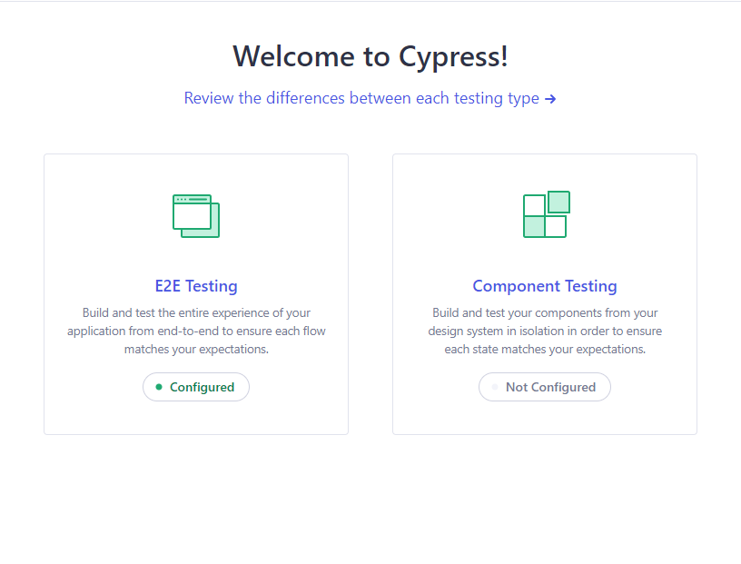
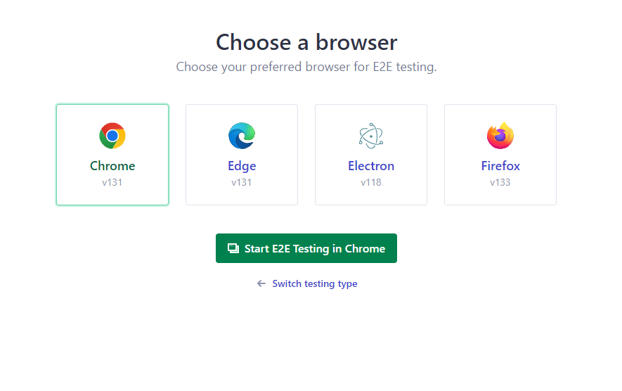
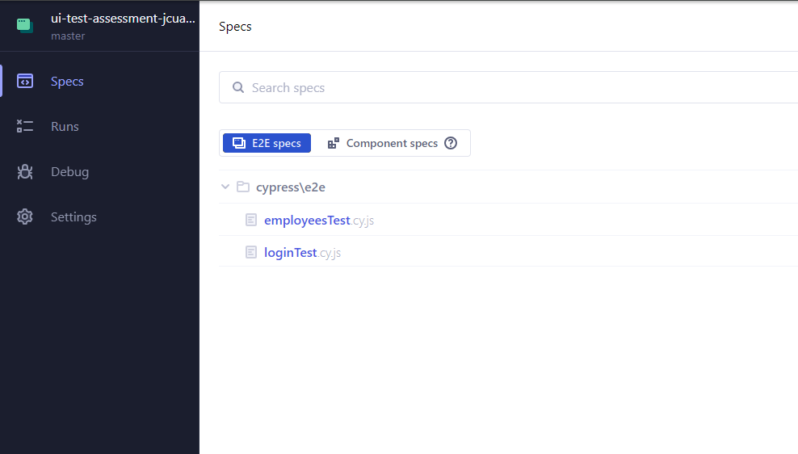
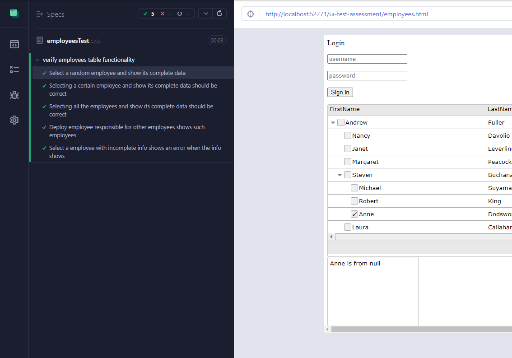

# Roche Technical assessment

## Installation

Before proceeding, make sure Node.js is installed on your system. To check, open a terminal or command prompt and enter the following commands:
```sh
node -v
npm -v
```
For more info, visit: [page to install node](https://nodejs.org/en/download/package-manager)

Clone this repository
```sh
git clone https://github.com/javiercuadrado16/ui-test-assessment.git
```

While in the same directory as the project, use the following command to install all the necessary dependencies required to run the project:
```sh
npm install
```
 This command will install all de node modules that currently are not added in the github repository due to the dimensions of the folder.

 ## Test execution

 To start running the test, enter the following command:
```sh
npx cypress open
```
This will open the cypress executor and then we must to select all the config:


Select E2E Testing



Select a browser in which the test will be executed



And then select the spec you want to execute

